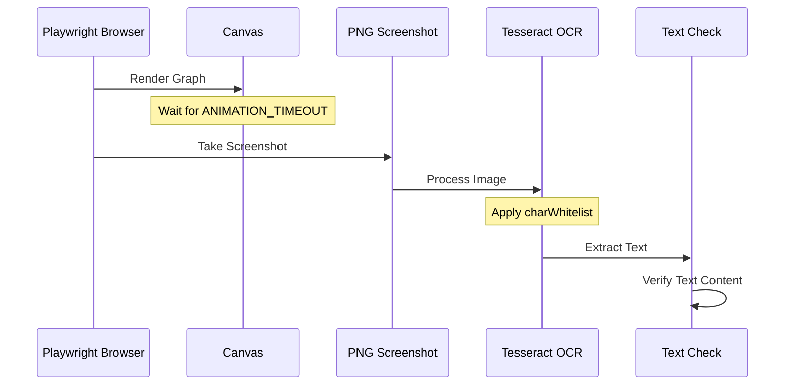

# Playwright Tesseract Integration

A project that demonstrates the integration of Playwright with Tesseract OCR for automated testing of canvas-based applications.

## Features

- Automated testing of canvas-based applications using Playwright
- OCR text extraction from canvas elements using Tesseract.js
- Visual regression testing with image comparison
- Docker support for consistent test execution
- GitHub Actions integration for CI/CD

## Prerequisites

- Node.js (v20 or later)
- npm (v10 or later)
- Docker (for running tests in a containerized environment)

## Installation

1. Clone the repository:
```bash
git clone https://github.com/yourusername/playwright-tesseract.git
cd playwright-tesseract
```

2. Install dependencies:
```bash
npm install
```

3. Install Playwright browsers:
```bash
npx playwright install
```

## Project Structure

```
playwright-tesseract/
├── tests/
│   ├── canvas.test.ts        # OCR-based test specifications
│   ├── image-comparison.spec.ts  # Visual regression tests
│   ├── utils.ts             # Shared test utilities
│   └── constants.ts         # Test configuration constants
├── app.js                   # Main application logic
├── package.json            # Project dependencies
├── playwright.config.ts    # Playwright configuration
└── Dockerfile             # Docker configuration
```

## Usage

### Running Tests

1. Start the application:
```bash
npm start
```

2. Run all tests:
```bash
npm test
```

3. Run specific test suites:
```bash
# Run OCR tests only
npm run test:ocr

# Run image comparison tests only
npm run test:image

# Update image comparison snapshots
npm run test:image:update
```

### Generating Snapshots in Docker

To ensure consistent snapshot generation across different environments, use Docker:

1. Build the Docker image:
```bash
docker build -t playwright-tesseract .
```

2. Generate snapshots using Docker:
```bash
# Run the container and execute snapshot tests
docker run --rm \
  --network host \
  -v $(pwd):/work/ \
  -w /work/ \
  playwright-tesseract \
  npm run test:image:update
```

## Testing

The project includes two types of tests:

### OCR-based Tests
Located in `tests/canvas.test.ts`, these tests use Tesseract OCR to:
- Extract text from canvas elements
- Verify node and edge labels
- Validate text content accuracy

### Visual Regression Tests
Located in `tests/image-comparison.spec.ts`, these tests ensure visual consistency by:
- Comparing screenshots of the graph layout
- Verifying node label rendering
- Checking edge label visibility
- Testing interactive elements

## OCR Testing Flow



The OCR testing process follows these steps:
1. Playwright renders the graph in the browser
2. After waiting for animations to complete, a screenshot is taken
3. The PNG image is processed by Tesseract OCR
4. OCR applies character whitelist (numbers and letters only)
5. Extracted text is verified against expected content

## Visual Testing Guidelines

1. **Baseline Images**
   - Store baseline screenshots in `tests/snapshots/`
   - Commit baseline images to version control
   - Review visual changes before updating baselines

2. **Test Scenarios**
   - Initial graph layout
   - Node label rendering
   - Edge label visibility
   - Interactive states

3. **Best Practices**
   - Use consistent viewport sizes
   - Wait for animations to complete
   - Allow for minor pixel differences in edge labels

## Contributing

1. Fork the repository
2. Create a feature branch
3. Make your changes
4. Run tests to ensure everything works
5. Submit a pull request

## License

MIT

## Acknowledgments

- Playwright team for the excellent testing framework
- Tesseract.js team for the OCR capabilities
- Cytoscape.js for the graph visualization library 